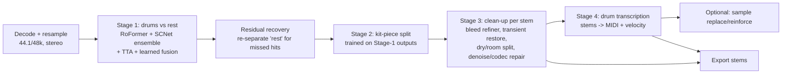

# Isolator: Game Plan

**Goal:** ship web and/or desktop software with the best drum isolation and drum clean-up available.

**Status:** plan only. Nothing is built yet. The research snapshot is from October 2026. Decisions that need an owner are listed in [§12](#12-decisions-needed-now).

---

## 0. The bet, in seven lines

1. **Quality comes from data, cascades, ensembles and evaluation, not from the app shell.** Web and desktop are the easy part. Build the model pipeline and the eval harness first.
2. **Licensing is a hard limit.** The best open drum weights have unknown provenance or a non-commercial license (see [§2](#2-state-of-the-art-october-2026)). If we sell this, we need our own models.
3. **Drums are the one stem where synthetic training data really works.** Drum audio is MIDI played through samples, rooms and mix chains, and we can render that at unlimited scale with clean licenses. The leading community kit-piece models and StemGMD/LarsNet are built this way. This is our moat.
4. **SDR misleads on drums.** BS-RoFormer leads on SDR, but it smears drum attacks about twice as much as SCNet-XL at equal SDR. We measure transients and use a mix of architectures.
5. **Build a cascade where each stage trains on the previous stage's real output:** mix → drums → kit pieces → clean-up → MIDI. This way each stage learns to fix the artifacts it will actually receive.
6. **"Clean-up" covers five different problems.** v1 ships bleed/artifact removal, a dry/room split, codec repair and MIDI export. Multi-mic de-bleed is a v2 product line.
7. **One Rust core and ONNX everywhere**, so the server, browser (WebGPU), desktop (Tauri) and a later DAW plugin all run the same pipeline code.

---

## 1. What "best" means

We define the product and the quality bar before writing code.

### 1.1 Product surface (v1)

| Capability | Output | Notes |
|---|---|---|
| **Drum isolation** | `drums`, `no_drums` | Option: "kit only" vs "kit + percussion" (shakers, congas, claps). 808s count as **bass** by default, with a toggle. |
| **Kit-piece split** | `kick`, `snare`, `toms`, `hihat`, `ride`, `crash` (+`perc_other`) | Toms are later split per drum by pitch clustering. Hi-hat open/closed comes through MIDI, not as audio stems. |
| **Clean-up** | strength sliders + `room` stem | Bleed/artifact removal, transient restore, dry/room split, denoise/codec repair. See §4.4. |
| **Drum → MIDI** | `.mid` with velocities | Uses the separated stems to improve transcription accuracy. Enables "replace/reinforce with samples." |
| **Export** | WAV/FLAC 24-bit at the source sample rate, MIDI, and a stem pack zip | Drag-and-drop into the DAW on desktop. |

### 1.2 Quality bar (exit criteria, measured by our harness in §6)

- **Drums vs rest:** match or beat the best public single model on the same test set. Today that is BS-RoFormer-SW at ≈14.1 dB SDR on MVSEP Multisong. Attack distortion must be **≤ SCNet-XL's level**.
- **Kit pieces:** match or beat the best public kit-piece numbers on the same test set. Hi-hat and cymbals are the weakest elements everywhere, at roughly 4–9 dB. That is where we can win.
- **Perceptual:** ≥ 60% preference in blind A/B tests against the best commercial competitor for each task, on our "wild" set of real songs, rated by trained listeners.
- **Speed:** a 4-minute song in under 60 s on a server GPU (full ensemble), under 3 min on an M-series Mac or RTX-class desktop, and under 5 min in-browser (single distilled model).

---

## 2. State of the art (October 2026)

### 2.1 Drums vs rest (from a full mix)

| Model | Drums SDR | Weights license | Verdict |
|---|---|---|---|
| MVSEP ensemble (MelBand + SCNet XL + BS-RoFormer SW) | ≈14.35 (Multisong) | Proprietary, server-only | Competitor benchmark |
| BS-RoFormer SW (6-stem) | ≈14.11 (Multisong) | **Unknown provenance.** The `bs-roformer-infer` maintainers explicitly warn against commercial use. | Research reference only |
| SCNet XL IHF (MUSDB-only) | 11.58 (Multisong) | Code MIT; weights trained on MUSDB (non-commercial data) | Architecture to adopt; retrain |
| BS-RoFormer (MUSDB-only) | 11.29 (Multisong) | Code MIT; MUSDB weights | Architecture to adopt; retrain |
| HTDemucs4 FT drums | 11.13 (Multisong) | MIT (Demucs). The upstream repo is unmaintained (fork at `adefossez/demucs`). | **Commercially safest strong baseline** |

So today a commercial-safe product starts about 3 dB behind the best weights you can download. The data engine (§5) has to close that gap.

### 2.2 Kit-piece separation (drum stem → pieces)

| Model | Reported SDR (each on its own test set) | License | Verdict |
|---|---|---|---|
| MVSEP DrumSep Mel-Band RoFormer (4/6-stem) | kick ≈18.7–22, snare ≈15–17, toms ≈15–16, cymbals ≈9–12, HH ≈9 | Proprietary/unclear | Quality target |
| DrumSep MDX23C 5-stem (jarredou) | kick 16.7, snare 11.5, toms 12.3, HH 4.0, cymbals 6.4 | Unclear | Research reference |
| LarsNet (5 parallel U-Nets, faster than real time) | — | **Weights CC BY-NC 4.0** | Reference; non-commercial |
| StemGMD dataset (1,224 h, 10 kits, 9 pieces) | — | **CC BY 4.0** | **Usable for training** |
| Separate-and-Detect (latent diffusion, 5 stems + onsets, Aug 2026) | improves transcription F1 over a U-Net baseline | Research checkpoint | Idea source for a generative refiner |

### 2.3 Clean-up, restoration, transcription

- **Music Source Restoration Challenge (ICASSP 2026).** The winner (SJTU X-LANCE) chained three BS-RoFormers: separation → dereverb → denoise. It scored 4.46 dB Multi-Mel-SNR overall and 3.42 dB on drums. **Percussion averaged only 0.29 dB across teams**, so the problem is wide open.
- **Apollo** (codec/MP3 restoration, band-split RoFormer + TCN) is licensed CC BY-SA 4.0. Use the method, retrain the model.
- **De-reverb and denoise** community models (Mel/BS-RoFormer) exist, but their licenses vary. We train our own.
- **Drum transcription.** ADTOF (model and dataset) is CC BY-NC-SA, so it's research only. STAR Drums (TISMIR 2025) is **CC BY 4.0** and beats MIDI-only training. Running transcription on separated stems improves it: 5→7 classes plus velocity estimation (Riley & Dixon).
- **Meta SAM Audio** (text/span-prompted separation, 0.5–3B parameters) uses the **SAM License, which allows commercial use**. It's too large to ship, but it's a candidate *teacher* and pseudo-labeler if it scores well on drums. Benchmark it in Phase 0.

### 2.4 Competitors

- **Kit-piece split:** Steinberg SpectraLayers 12 (6 kit pieces), Acon Digital Remix:Drums (real-time, 6 stems), and an Ableton "DrumSep" extension built on MDX23C.
- **Multi-mic de-bleed:** Acon DeBleed:Drums ($99, neural + DSP, real-time), MeldaProduction MDrumCleaner (2026), Auphonic Mic Bleed Remover (Oct 2025).
- **Four-stem-only DAW splitters:** Logic Pro Stem Splitter, Ableton Live 12.3 (powered by Music.ai), zplane PEEL STEMS 2 (real-time).
- **Services:** MVSEP, LALAL.AI, AudioShake, Music.ai.

**Gap we target:** nobody ships *isolation + kit split + real clean-up + MIDI* as one top-quality pipeline. The best kit-split quality sits on MVSEP's server and isn't licensable.

---

## 3. Strategy: two tracks

```
Track R (Reference): uses the best available weights, for internal use only.
  Purpose: measure the current ceiling, build the harness, design the UX, write demo pipelines.
  Rule: never ships to customers commercially and is never distilled into shipped models
        unless the weights' license allows it.

Track C (Commercial): only our own models, trained on cleanly licensed data.
  Purpose: what ships.
  Rule: every dataset, sample library, impulse response and checkpoint goes in
        LICENSES.md, with proof the license permits ML training and commercial use.
```

If the product is personal or non-commercial (§12, decision 1), Track R can ship directly and the timeline shrinks by about 2 months.

---

## 4. System architecture

### 4.1 Pipeline



### 4.2 Stage 1: drums vs rest

- **Dedicated single-target drum models**, which beat multi-stem models on the target stem. Run at least two architecture families: **Mel/BS-RoFormer** for SDR and bleed rejection, and **SCNet-XL** for transients.
- **Learned per-band fusion** instead of plain averaging. A small network weights the models per frequency band and frame. It is trained to maximize SDR plus a transient-preservation term.
- **Test-time augmentation (TTA):** time shifts, L/R swap and polarity flip. Overlap-add at 50–75% with matched windows.
- **Loss:** L1 on the waveform + multi-resolution STFT + an **onset-weighted term** (a spectral-flux-weighted loss around attacks). Optional short adversarial fine-tune for perceived punch.
- **Residual recovery:** run the drum model again on `no_drums` and add back confident hits. Ensure the outputs still sum to the mixture (mixture consistency).

### 4.3 Stage 2: kit pieces

- **Train on what Stage 1 actually outputs, not on clean drums.** Run the Stage-1 model over synthetic mixes and train Stage 2 on those artifact-laden estimates. Run an A/B against an end-to-end mix→pieces model and keep the winner.
- Use higher frequency resolution for the top bands and support 48 kHz, so cymbal "air" survives.
- **Per-tom splitting:** cluster tom hits by pitch and decay, then gate and mask the toms stem.
- Also output a `room` stem (see §4.4) so that kit pieces come out close-mic dry.

### 4.4 Stage 3: what "clean-up" means

These are five separate problems. We pick which ones ship first.

| # | Problem | Approach | Ship |
|---|---|---|---|
| C1 | **Bleed/artifact removal** from isolated stems (vocal/guitar ghosts) | Refiner network conditioned on (mixture, estimate), trained on real Stage-1 and Stage-2 outputs → ground truth. The UI slider trades "fullness" against "bleedless." | v1 |
| C2 | **Transient restoration** (masking smears attacks) | Generative refiner (GAN, flow matching, or latent diffusion as in Separate-and-Detect) constrained to stay consistent with the mixture so it can't hallucinate hits | v1.x |
| C3 | **Dry/room split** (de-reverb as a stem, not a deletion) | Band-split RoFormer trained on dry kit pieces + room impulse responses + multi-mic room channels | v1 |
| C4 | **Restoration** of degraded sources: MP3/YouTube codec artifacts, noise, clipping, limited bandwidth | Apollo-style band-sequence model plus a chained dereverb/denoise stage (as in the MSR-winning design), trained on our degradation simulator | v1 (codec), v1.x (rest) |
| C5 | **Multi-mic de-bleed** for real recorded multitracks (kick mic hears snare, etc.) | Multichannel model: N mic inputs → N cleaned mics. Trained on synthetic multi-mic renders with simulated bleed. Real-time capable. | **v2 product line** (plugin) |
| C6 | **Replace/reinforce** | MIDI from Stage 4 → sample trigger, with a blend control | v1 (MIDI), v1.x (sample engine) |

### 4.5 Runtime architecture: one core, four targets

```
            training (PyTorch, Python)
                     |  export: ONNX (opset 17+), fp16 + fp32
                     |  STFT/iSTFT and RoPE tables OUTSIDE the graph
                     v
   +------------------ core/ (Rust) ------------------+
   | decode (symphonia) | resample | STFT/iSTFT        |
   | chunk/overlap-add  | TTA      | ensemble fusion   |
   | pipeline graph     | progress/cancel | export     |
   | inference: ONNX Runtime via `ort`                 |
   +-------+-------------+--------------+--------------+
           |             |              |
   native (server)   native (desktop)  wasm32 (browser)    C ABI (later)
   CUDA/TensorRT     CUDA/DirectML/    onnxruntime-web     JUCE VST3/AU/AAX
                     CoreML            WebGPU EP           + ARA2 plugin
```

- **Server:** Python workers at first, for fast iteration. Move to the Rust core + TensorRT once the models stabilize. GPU job queue, signed upload URLs, stems deleted after 24 h.
- **Browser:** a single distilled fp16 model of about 300 MB, which is known to work: a BS-RoFormer ONNX export already runs in `onnxruntime-web` on WebGPU with 4-s chunks and STFT done in JS. Cache models in OPFS. Check for `shader-f16` support and fall back to fp32 or WASM when it's missing. Run inference in a Web Worker. WebGPU has been Baseline since Jan 2026: Chrome/Edge, Safari 26, Firefox on Windows/macOS. Firefox on Linux/Android is still behind.
- **Desktop: Tauri 2** with the same web UI and the Rust core. The app is small and native, with no Electron runtime. Models download on first run and are verified by SHA-256. Code-signed and notarized, with auto-update.
- **Plugin (v2):** JUCE + **ARA2** for offline, full-quality processing inside Logic/Cubase/Studio One/Reaper, plus a low-latency real-time mode with small models. Multi-mic de-bleed (C5) lives here.

**Recommendation:** start web-first with server inference. It gives the best quality on any user hardware and the fastest feedback loop. Add "process locally in browser" for privacy and to save cost. Ship a Tauri desktop app from the same UI as soon as the Rust core is stable. Desktop also sidesteps hosting copyrighted uploads.

---

## 5. Data engine ("DrumForge"): the moat

Drum audio is generated by a known process, so we simulate it:

```
MIDI performances x kits (multi-mic, multi-velocity) x rooms x players' feel
  x mix chains x accompaniment x degradations  ->  (mixture, every stem, dry/room, MIDI)
```

| Ingredient | Clean-license sources | To acquire or build |
|---|---|---|
| MIDI grooves | Groove MIDI (CC BY 4.0), E-GMD (CC BY 4.0, 444 h on 43 kits), STAR Drums annotations (CC BY 4.0) | Procedural groove generator: genre templates, fills, ghost notes, blast beats, humanization |
| Drum audio | StemGMD (CC BY 4.0, 10 kits × 9 pieces) | **Record our own multi-sampled kits** (multi-mic: close, OH, room, plus a bleed matrix): 1–2 studio weeks covers 6–10 kits. Commercial sample libraries only with **written ML-training permission** (standard EULAs usually forbid it). |
| Electronic drums | Synthesis: 808/909-style models, procedural one-shots | CC0 one-shot packs after review |
| Rooms | Measured impulse responses with permissive licenses | Our own IR captures in the studio sessions |
| Mix chains | Randomized pro-style chains: EQ, compression, transient shaping, saturation, bus compression, parallel compression, gating, reverb, sidechain | Our own DSP (pedalboard/DawDreamer-style); built-in plugins only |
| Accompaniment | Slakh2100 (CC BY 4.0, synthesized) | **Licensed real multitracks** (production-music libraries, direct artist deals). Biggest budget line; see §10. |
| Degradations | Codecs (MP3/AAC/Opus at 64–320 kbps), clipping/limiting, lo-fi, tape/vinyl, phone/live-room capture, bandwidth limits | Our own simulator, which also drives C4 |
| Real ground truth | — | **Record real drummers** multitracked (5–20 h) on owned kits: real gold-standard test data plus fine-tuning data |

**Training curriculum:** pretrain on massive synthetic data → fine-tune on real multitracks → train each stage on the previous stage's output → short perceptual fine-tune.

---

## 6. Evaluation harness (built first, gates every merge)

**Test sets**

| Set | Content | Purpose |
|---|---|---|
| `gold` | Our licensed and recorded multitracks; never used for training | **Primary decision set** |
| `research` | MUSDB18-HQ test, MoisesDB (non-commercial) | Comparison with published numbers; internal only |
| `kit` | Real recorded kits + StemGMD held-out kits | Kit-piece metrics |
| `wild` | 150–300 real songs across genres, eras and source quality, no ground truth | Listening tests, reference-free metrics, competitor A/B |

**Metrics**

| Metric family | What we compute |
|---|---|
| Separation quality | SDR (chunked-median and full-song), SI-SDR, "fullness/bleedless" spectral metrics |
| Restoration | Multi-Mel-SNR |
| Perceptual | FAD-CLAP, Zimtohrli |
| Rhythm and transients | Onset F1, attack-slope / crest-factor distortion |
| Engineering | Real-time factor, peak memory |

**Listening tests:** webMUSHRA panels with fixed trained listeners, plus blind A/B against MVSEP, LALAL.AI, AudioShake, SpectraLayers and Logic.

**Leaderboard:** every checkpoint gets a row. A model only ships if it improves `gold` without regressing transients.

---

## 7. Roadmap

Timeline assumes Claude does most implementation, with one or two humans for audio judgement, recording sessions, GPU and infra accounts, and listening panels.

### Phase 0: Foundations (weeks 0–2)
- Monorepo skeleton (§9), `LICENSES.md` audit, CI.
- Eval harness v1, plus benchmarks of every candidate (§2) on `research` and `wild`: Demucs, SCNet, RoFormers, DrumSep variants, LarsNet, SAM Audio.
- Tag every candidate green, yellow or red by license.
- **Exit:** leaderboard published internally; decisions in §12 made.

### Phase 1: Reference pipeline, Track R (weeks 2–5)
- Python CLI implementing the full §4.1 cascade using the best available weights: ensemble, TTA, kit split, dereverb/denoise, transcription.
- Minimal web UI: upload → stems mixer (solo/mute/level), A/B, downloads.
- **Exit:** we know today's ceiling per stage, and the UX is validated with 5–10 target users.

### Phase 2: DrumForge + our own models, Track C (weeks 3–14, in parallel)
- Weeks 3–6: data engine v1 (MIDI × StemGMD × mix chains × Slakh × degradations); studio recording sessions booked.
- Weeks 5–10: train Stage 1 (RoFormer + SCNet), fusion, and Stage 2 on Stage-1 outputs.
- Weeks 8–14: train C1 refiner, C3 dry/room, C4 codec repair, and transcription; distill a browser-sized model.
- **Exit:** Track C meets the §1.2 bar on `gold`, or we know exactly how far short it is and why.

### Phase 3: Product (weeks 6–16)
- Rust core: DSP, chunking, fusion and ORT. Parity tests against PyTorch must be within 0.05 dB SDR.
- ONNX export with fp16/fp32 parity tests.
- Web app (server mode + WebGPU local mode), GPU inference service, accounts and billing if commercial.
- Tauri desktop app (macOS/Windows), signed, with auto-update.
- **Exit:** private beta.

### Phase 4: Ship and expand (week 16+)
- v1 public: isolation + kit split + C1/C3/C4 + MIDI.
- v1.x: generative transient restoration (C2), sample replace engine, batch mode, public API.
- v2: JUCE/ARA2 plugin, multi-mic de-bleed (C5), real-time low-latency mode.

---

## 8. Engineering rules

- Every model: config + weights + data manifest + license manifest + eval row. No exceptions.
- ONNX exports keep numerically sensitive operations (rotary embeddings, normalization, STFT/iSTFT) in fp32.
- Deterministic chunking: overlap-add must reconstruct the input exactly when the model is an identity (unit test).
- `stems sum ≈ mixture` checks run in CI on every pipeline change.
- Models are versioned artifacts (content-addressed). Apps pin model versions.

---

## 9. Proposed repo layout

```
isolator/
  docs/                 plans, model cards, LICENSES.md audit
  research/             Python (uv): training, data engine, eval
    drumforge/          synthetic data engine
    train/              MSST-based training (MIT) + our losses/fusion
    eval/               harness, metrics, leaderboard, webMUSHRA configs
    export/             ONNX export + parity tests
  core/                 Rust: DSP, pipeline, ORT inference (native + wasm32)
  apps/web/             Vite + TypeScript UI; WebGPU inference worker
  apps/desktop/         Tauri 2 shell around apps/web + core
  services/inference/   GPU job service (queue, storage TTL, signed URLs)
  plugin/               (v2) JUCE + ARA2 via core's C ABI
```

---

## 10. Compute, data and budget (rough; firm up in Phase 0)

| Item | Estimate |
|---|---|
| Training compute | One 8×H100-class node for ~2–3 months covers Stage 1/2, refiners and transcription. Roughly **$30–90k** rented. Community-scale models train on 1–4 GPUs over weeks, so a leaner path exists at lower quality. |
| Studio recording (kits, IRs, real drummers) | 2–3 weeks of studio + drummer + engineer: **$10–30k** |
| Licensed multitracks for accompaniment and real ground truth | **Widest range ($10k–$100k+)**; this is where AudioShake/Music.ai spend |
| Inference (server) | Order of **cents per song** for a full ensemble on a rented GPU. Measure in Phase 0. |
| Browser/desktop | ~$0 marginal inference cost; model hosting/CDN only |

Note: this cloud session has **no GPU**, and **huggingface.co is blocked** by the current network policy. Training and benchmarking need a GPU box or cloud account. Downloading checkpoints here needs the environment's network policy widened.

---

## 11. Risks and mitigations

| Risk | Mitigation |
|---|---|
| Our Track-C models stay behind unlicensable weights | Synthetic drum data is the lever. Recorded real kits close the domain gap. Commercially licensed teachers such as SAM Audio supply pseudo-labels. Fallback: license a vendor API for the server tier. |
| SDR improves but drums sound worse | Transient metrics + listening panel gate every release (§6) |
| Generative clean-up hallucinates hits | Mixture-consistency constraint, onset agreement with the mixture, strength slider defaulting to conservative |
| Browser memory and WebGPU quirks (no `shader-f16`, Safari differences) | Distilled fp16 model, 4–8 s chunks, feature detection with fp32/WASM fallback, server fallback |
| Copyright exposure from user uploads | Per-user processing only, 24 h retention, no training on user audio without opt-in, DMCA process; desktop/local modes |
| Sample-library EULAs forbid ML training | Record our own kits; get written permissions; keep the LICENSES.md audit |
| Taxonomy disputes (808s, claps, percussion) | User-visible toggles; labels in DrumForge carry fine-grained classes so taxonomies can be remapped |

---

## 12. Decisions needed now

1. **Commercial or personal/research?** This decides whether Track R can ship and whether Track C is required.
2. **First surface:** web (server GPU), desktop (local), or both from day one? Recommended: web + server first, Tauri desktop right after.
3. **Which clean-up first?** Recommended v1: C1 bleed removal + C3 dry/room + C4 codec repair + MIDI. Multi-mic de-bleed (C5) becomes the v2 plugin.
4. **Target user:** producers/remixers, drummers (practice/transcription), mixing engineers, or DJs/creators. This changes UX and defaults.
5. **Budget and compute:** GPU provider/account, studio recording budget, multitrack licensing budget.

---

## Sources

- MVSEP algorithms & leaderboards: https://mvsep.com/en/algorithms, https://mvsep.com/quality_checker/multisong_leaderboard, https://mvsep.com/quality_checker/leaderboard/drumsep5
- MSST (training framework, MIT) and pretrained model table: https://github.com/ZFTurbo/Music-Source-Separation-Training
- BS-RoFormer (Lu et al., SDX23 winner): https://arxiv.org/abs/2309.02612
- bs-roformer-infer (BS-RoFormer-SW provenance warning): https://github.com/openmirlab/bs-roformer-infer
- BS-RoFormer-SW ONNX for onnxruntime-web/WebGPU: https://huggingface.co/elicwhite/bs-roformer-sw-6stem-onnx
- Demucs (MIT, maintained fork): https://github.com/adefossez/demucs
- LarsNet / StemGMD: https://github.com/polimi-ispl/larsnet, https://zenodo.org/records/7860223
- Beyond SDR (rhythm/transient distortion by separators): https://arxiv.org/abs/2609.04224
- Music Source Restoration challenge summary: https://arxiv.org/abs/2601.04343; winner system: https://arxiv.org/abs/2602.09042; challenge site: https://msrchallenge.com/
- Apollo restoration: https://arxiv.org/abs/2409.08514, https://github.com/JusperLee/Apollo
- Separate-and-Detect (latent-diffusion drum stems + transcription): https://arxiv.org/abs/2608.01093
- Enhanced ADT via drum stem separation: https://arxiv.org/abs/2509.24853
- STAR Drums dataset (CC BY 4.0): https://transactions.ismir.net/articles/10.5334/tismir.244
- ADTOF: https://github.com/MZehren/ADTOF
- Meta SAM Audio: https://www.theregister.com/2025/12/16/meta_sam_ai_audio/, https://github.com/facebookresearch/sam-audio
- MoisesDB (CC BY-NC-SA 4.0): https://github.com/moises-ai/moises-db; MUSDB18-HQ: https://zenodo.org/records/3338373
- ONNX Runtime Web / WebGPU EP: https://onnxruntime.ai/docs/tutorials/web/ep-webgpu.html
- WebGPU status 2026: https://www.utsubo.com/blog/frontier-web-apis-2026-production-ready
- Competitors: https://acondigital.com/products/debleed-drums, https://rekkerd.org/meldaproduction-launches-mdrumcleaner-drum-bleed-elimination-plugin/, https://auphonic.com/blog/2025/10/08/mic-bleed-remover/, https://download.steinberg.net/downloads_software/SpectraLayers_12/help/Pro/_unmix_drums.html, https://djmag.com/news/ableton-unveils-stem-separation-tool-live-123-update, https://sonicstate.com/news/2026/07/09/real-time-stem-separation-upgrade-/
